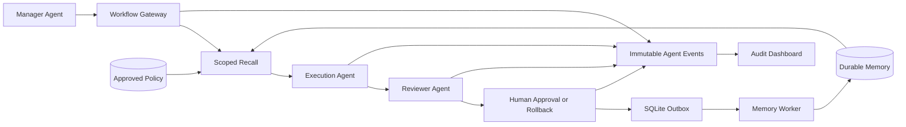

# MemoryVault

> Local-first Agent MemoryOps infrastructure for reliable memory sharing across agents, people, projects, and devices.

[中文文档](README_CN.md)

MemoryVault is more than an MCP memory server. It adds a governed execution layer around shared agent memory: durable event capture, an SQLite Outbox, extraction workers, scoped recall, approved policies, versioned references, human review, audit traces, and per-space E2EE.

The reference scenario is an agency team serving Hospital A. When the usual copywriter is absent, another employee's agent can retrieve the permitted Hospital A rules and preferences, produce a draft, pass an independent policy review, wait for human approval, and write reusable experience back to the shared vault.

## Why It Exists

An MCP connection alone does not guarantee that a model will call memory tools. MemoryVault therefore supports two runtime modes:

| Runtime | Guarantee |
|---|---|
| Generic MCP clients such as Codex, Claude Code, and Kimi | Compatible, but proactive recall and write behavior remains best-effort unless the client provides hooks |
| Managed Workflow Gateway and AgentTeams | Enforces lifecycle order, scoped recall, role separation, policy attestation, human approval, audit, and idempotent writeback |

## Architecture



The data boundary is `tenant_id + project + scope + space_id`. Every recalled memory carries `memory_ref=<id>@<revision>`; every mandatory rule carries `policy_ref=<id>@<revision>`.

## Implemented Capabilities

- SQLite + `sqlite-vec` semantic memory with Ollama `nomic-embed-text`
- Immutable `agent_events`, idempotency keys, SQLite Outbox, retry, stale lease recovery, and dead letters
- Memory Worker with classification, secret redaction, sensitivity levels, confidence routing, and human review
- Tenant, project, personal/team scope, and exact team-space isolation
- Versioned memory correction, conflict detection, deduplication, tombstones, incremental cursors, and retryable sync
- Draft/approved/retired Policy store; only exact approved revisions enter governed context
- Managed workflow state machine: start, writer artifact, independent review, human publish or rollback, experience writeback
- Per-space AES-256-GCM data keys, X25519 member envelopes, Ed25519 signatures, key rotation, member revocation, and member-scoped RBAC tokens
- Streamable HTTP and stdio MCP transports
- Operations Dashboard for traces, Outbox, dead letters, pending memories, policies, and workflow approvals
- Claude Code SessionEnd extraction, Codex session sweep, CLI import/export, and optional Supabase personal sync
- AgentTeams Manager, Team Leader, Writer, Reviewer, and four packaged Skills

## Quick Start

Prerequisites: Node.js `>=18`, `pnpm`, and Ollama.

```bash
git clone https://github.com/fusae/Memory-Vault.git
cd Memory-Vault
ollama pull nomic-embed-text
pnpm install
pnpm build
pnpm link --global
```

Or use the interactive installer:

```bash
bash scripts/setup.sh
```

Available binaries:

- `memory-vault`: stdio MCP server
- `memory-vault-http`: Streamable HTTP MCP server
- `memory-vault-worker`: supervised Outbox consumer
- `memory-vault-cli`: administration CLI
- `memory-vault-dashboard`: audit and approval UI
- `memory-vault-demo-hospital-a`: deterministic end-to-end demo

## Hospital A Demo

Run the complete local workflow without an external LLM:

```bash
MEMORY_DB_PATH=/tmp/memory-vault-hospital-a.db pnpm demo:hospital-a
```

The JSON evidence includes `task_id`, `trace_id`, `memory_ref`, `policy_ref`, artifact revision, review result, human approver, Outbox status, event count, and a database plaintext check.

The deployable AgentTeams example is in [`examples/agentteams-hospital-a`](examples/agentteams-hospital-a/README.md).
The verified real-model run is documented in [`docs/agentteams-real-run.md`](docs/agentteams-real-run.md).
The competition deck is [`docs/MemoryVault-GOAI-Agent-Infra.pptx`](docs/MemoryVault-GOAI-Agent-Infra.pptx), with a presenter script in [`docs/demo-script.md`](docs/demo-script.md).

## MCP Integration

### Stdio

Claude Code:

```bash
claude mcp add memory-vault node /absolute/path/to/Memory-Vault/build/index.js
claude mcp list
```

Codex CLI:

```bash
codex mcp add memory-vault -- node /absolute/path/to/Memory-Vault/build/index.js
codex mcp list
```

Generic MCP configuration:

```json
{
  "command": "node",
  "args": ["/absolute/path/to/Memory-Vault/build/index.js"]
}
```

### Streamable HTTP

For shared runtimes, create one hash-only Principal per Agent. The generated bearer token is shown once; `--token-env` hashes an existing runtime token without printing or storing it.

```bash
memory-vault-cli http-principal add \
  --id hospital-a-lead --role manager --tenant agency \
  --projects hospital-a --spaces hospital-a-copy

MEMORYVAULT_HTTP_HOST=127.0.0.1 \
MEMORYVAULT_HTTP_PORT=3090 \
MEMORYVAULT_HTTP_PRINCIPALS_FILE=~/.memoryvault/http-principals.json \
memory-vault-http
```

Endpoint: `http://127.0.0.1:3090/mcp`.

The Principal file is mode `0600`, contains SHA-256 token hashes only, and binds each call to an Agent role, tenant, project, space, and actor identity. `MEMORYVAULT_HTTP_TOKEN` remains available only for legacy single-user clients. Unauthenticated non-loopback HTTP is refused unless `MEMORYVAULT_HTTP_ALLOW_INSECURE=1` is explicitly enabled for a local demo.

## Governed MCP Tools

MemoryVault currently exposes 25 tools, grouped as follows:

- Memory: `memory_write`, `memory_search`, `memory_list`, `memory_update`, `memory_correct`, `memory_review_decide`, `memory_forget`, `memory_delete`, `memory_consolidate`, `memory_versions`, `memory_export`, `memory_export_markdown`, `memory_dream`
- Policy: `policy_write`, `policy_approve`, `policy_list`
- Reliable events: `agent_event_record`, `memory_worker_run`, `memory_recall_context`
- Production Outbox consumer: run `memory-vault-worker` as a supervised service; tune it with `MEMORYVAULT_WORKER_BATCH_SIZE` and `MEMORYVAULT_WORKER_POLL_MS`.
- Managed workflow: `workflow_start`, `workflow_recall`, `workflow_submit_draft`, `workflow_submit_review`, `workflow_human_decide`, `workflow_get`

Allowed recall triggers are `task_start`, `failure_retry`, `agent_handoff`, and `tool_boundary`. Managed workflows always pass an exact `space_id`; `workflow_recall` enforces retry attempts, active-role ownership, and approved Policy tool boundaries.

## Team Space E2EE

Each device creates a local X25519 and Ed25519 identity. Private keys remain in `~/.memoryvault/space-identity.json` with mode `0600`.

Owner:

```bash
memory-vault-cli space identity-init alice
memory-vault-cli space init-encrypted hospital-a-copy --name "Hospital A Copy"
```

New member:

```bash
memory-vault-cli space identity-init bob
memory-vault-cli space identity-export --output bob-public.json
```

Owner creates a signed invitation and member-scoped remote token:

```bash
memory-vault-cli space invite hospital-a-copy bob-public.json --output bob-invitation.json
memory-vault-cli space issue-token hospital-a-copy bob --role writer
```

Member accepts the invitation, then joins the remote server with the issued token:

```bash
memory-vault-cli space accept bob-invitation.json
memory-vault-cli space join hospital-a-copy --name "Hospital A Copy" --url http://server:3100 --token 'mvs_...'
```

Rotate or revoke:

```bash
memory-vault-cli space rotate hospital-a-copy
memory-vault-cli space revoke hospital-a-copy bob
```

Revocation disables Bob's tokens and immediately rotates the data key. The server stores ciphertext and signed key envelopes, not plaintext DEKs.

## Dashboard

```bash
memory-vault-dashboard
```

Open [http://localhost:3080](http://localhost:3080). The Operations view shows workflow approvals, memory review, event traces, Outbox retries, dead letters, redactions, and approved Policy counts.

The Dashboard binds to `127.0.0.1` by default and rejects non-loopback hosts because it contains human approval actions. Remote access must use an authenticated reverse proxy.

## Automatic Capture

Claude Code can use [`scripts/session-end-hook.sh`](scripts/session-end-hook.sh) from `~/.claude/settings.json`. Codex sessions can be imported opportunistically with:

```bash
memory-vault-cli sweep-codex
```

Generic MCP clients have no universal session-end lifecycle guarantee. For business-critical tasks, use the Workflow Gateway or AgentTeams example rather than relying on model instructions.

## Personal Encryption and Supabase Sync

`MEMORYVAULT_PASSPHRASE` enables AES-256-GCM encryption for personal memories. Team spaces use independent versioned space keys. Optional Supabase setup remains available for personal cross-device sync:

```bash
memory-vault-cli setup
memory-vault-cli auth login
memory-vault-cli sync
```

Run [`scripts/setup-supabase.sql`](scripts/setup-supabase.sql) first. For OTP emails, configure Supabase `Authentication -> Email Templates -> Magic Link` with `{{ .Token }}`.

## Verification

```bash
pnpm build
pnpm test
pnpm validate:agentteams
```

The suite covers migrations, vec0 writes, conflict isolation, governance, Outbox retry/dead-letter recovery, HTTP MCP handshake, workflow replay, human rollback, E2EE invitations, key rotation, RBAC, sync tombstones, Dashboard APIs, and the Hospital A end-to-end scenario.

## License

MIT
