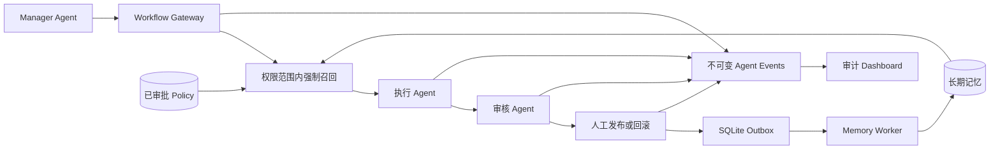

# MemoryVault

> 本地优先的 Agent MemoryOps 基础设施，让不同员工、Agent、项目和设备安全共享可追责的长期记忆。

[English](README.md)

MemoryVault 不只是一个 MCP 记忆服务器。它在共享记忆外增加了可靠事件、SQLite Outbox、Memory Worker、权限隔离、审批 Policy、版本引用、人工审核、审计追踪和空间级 E2EE。

参考场景是“医院 A 原文案负责人缺席”：同事的执行 Agent 在授权范围内召回医院 A 的规则、客户偏好和历史经验，完成文案后交给独立审核 Agent，等待客户负责人批准，再把可复用经验写回团队空间。

## 两种运行保证

| 运行方式 | 保证级别 |
|---|---|
| Codex、Claude Code、Kimi 等通用 MCP 客户端 | 可以搜索和写入，但主动调用仍取决于客户端 Hook、模型和提示词，属于 best-effort |
| Workflow Gateway + AgentTeams | 服务端强制任务顺序、空间召回、角色隔离、Policy 证明、人工审批、审计和幂等写回 |

## 架构



数据边界是 `tenant_id + project + scope + space_id`。召回的每条记忆携带 `memory_ref=<id>@<revision>`，强制规则携带 `policy_ref=<id>@<revision>`。

## 已实现能力

- SQLite + `sqlite-vec` + Ollama 本地语义记忆
- 不可变 `agent_events`、幂等键、SQLite Outbox、指数重试、租约恢复和死信
- Memory Worker 分类、密钥脱敏、敏感级别、低置信审核和人工确认
- tenant、project、personal/team scope、精确 space 权限隔离
- 记忆版本、纠错、冲突检测、去重、Tombstone、增量游标和失败同步重试
- Policy 草稿、审批、退役；只有当前已审批版本进入上下文
- 受控工作流：开始、Writer 工件、独立审核、人工发布或回滚、经验写回
- 空间 AES-256-GCM 数据密钥、X25519 成员信封、Ed25519 签名、轮换、撤销和成员 RBAC Token
- stdio 与 Streamable HTTP MCP
- Operations Dashboard：Trace、Outbox、死信、待审核记忆、Policy 和工作流审批
- Claude Code SessionEnd、Codex sweep、CLI 导入导出和可选 Supabase 个人同步
- AgentTeams Manager、Team Leader、Writer、Reviewer 及四个 Skills

## 快速开始

前置环境：Node.js `>=18`、`pnpm`、Ollama。

```bash
git clone https://github.com/fusae/Memory-Vault.git
cd Memory-Vault
ollama pull nomic-embed-text
pnpm install
pnpm build
pnpm link --global
```

也可以运行交互安装：

```bash
bash scripts/setup.sh
```

可用命令：

- `memory-vault`：stdio MCP Server
- `memory-vault-http`：Streamable HTTP MCP Server
- `memory-vault-worker`：常驻 Outbox 消费者
- `memory-vault-cli`：管理 CLI
- `memory-vault-dashboard`：审计与审批界面
- `memory-vault-demo-hospital-a`：医院 A 确定性端到端演示

## 医院 A 一键演示

无需外部 LLM 即可运行完整闭环：

```bash
MEMORY_DB_PATH=/tmp/memory-vault-hospital-a.db pnpm demo:hospital-a
```

输出 JSON 包含 `task_id`、`trace_id`、`memory_ref`、`policy_ref`、工件版本、审核结论、人工审批人、Outbox 状态、事件数量和数据库明文检查。

AgentTeams 部署示例位于 [`examples/agentteams-hospital-a`](examples/agentteams-hospital-a/README.md)。
真实模型运行证据见 [`docs/agentteams-real-run.md`](docs/agentteams-real-run.md)。
赛事方案见 [`docs/MemoryVault-GOAI-Agent-Infra.pptx`](docs/MemoryVault-GOAI-Agent-Infra.pptx)，演示讲稿见 [`docs/demo-script.md`](docs/demo-script.md)。

## MCP 接入

Claude Code：

```bash
claude mcp add memory-vault node /绝对路径/Memory-Vault/build/index.js
claude mcp list
```

Codex CLI：

```bash
codex mcp add memory-vault -- node /绝对路径/Memory-Vault/build/index.js
codex mcp list
```

HTTP MCP：

共享运行时应为每个 Agent 创建独立 Principal。自动生成的 Bearer Token 只显示一次；`--token-env` 可直接哈希现有运行时 Token，不打印也不保存明文。

```bash
memory-vault-cli http-principal add \
  --id hospital-a-lead --role manager --tenant agency \
  --projects hospital-a --spaces hospital-a-copy

MEMORYVAULT_HTTP_HOST=127.0.0.1 \
MEMORYVAULT_HTTP_PORT=3090 \
MEMORYVAULT_HTTP_PRINCIPALS_FILE=~/.memoryvault/http-principals.json \
memory-vault-http
```

地址为 `http://127.0.0.1:3090/mcp`。

Principal 文件权限固定为 `0600`，只保存 Token 的 SHA-256，并把每次调用绑定到 Agent 角色、租户、项目、空间和执行身份。`MEMORYVAULT_HTTP_TOKEN` 仅保留给旧版单用户客户端；未认证的非回环 HTTP 默认拒绝启动，只有本地演示才可显式设置 `MEMORYVAULT_HTTP_ALLOW_INSECURE=1`。

## MCP 工具

当前共 25 个工具：

- 记忆：`memory_write`、`memory_search`、`memory_list`、`memory_update`、`memory_correct`、`memory_review_decide`、`memory_forget`、`memory_delete`、`memory_consolidate`、`memory_versions`、`memory_export`、`memory_export_markdown`、`memory_dream`
- Policy：`policy_write`、`policy_approve`、`policy_list`
- 可靠事件：`agent_event_record`、`memory_worker_run`、`memory_recall_context`
- 生产 Outbox 消费者：使用进程守护器常驻运行 `memory-vault-worker`；可通过 `MEMORYVAULT_WORKER_BATCH_SIZE` 和 `MEMORYVAULT_WORKER_POLL_MS` 调整批量与轮询间隔。
- 受控工作流：`workflow_start`、`workflow_recall`、`workflow_submit_draft`、`workflow_submit_review`、`workflow_human_decide`、`workflow_get`

召回只允许 `task_start`、`failure_retry`、`agent_handoff`、`tool_boundary` 四种触发。受控工作流必须提供精确 `space_id`；`workflow_recall` 强制校验重试序号、当前执行角色和已审批 Policy 工具边界。

## 团队空间 E2EE

每台设备生成 X25519 加密身份和 Ed25519 签名身份，私钥保存在 `~/.memoryvault/space-identity.json`，权限为 `0600`。

Owner：

```bash
memory-vault-cli space identity-init alice
memory-vault-cli space init-encrypted hospital-a-copy --name "Hospital A Copy"
```

新成员：

```bash
memory-vault-cli space identity-init bob
memory-vault-cli space identity-export --output bob-public.json
```

Owner 创建签名邀请和远程访问 Token：

```bash
memory-vault-cli space invite hospital-a-copy bob-public.json --output bob-invitation.json
memory-vault-cli space issue-token hospital-a-copy bob --role writer
```

成员接受邀请并连接 Space Server：

```bash
memory-vault-cli space accept bob-invitation.json
memory-vault-cli space join hospital-a-copy --name "Hospital A Copy" --url http://server:3100 --token 'mvs_...'
```

轮换和撤销：

```bash
memory-vault-cli space rotate hospital-a-copy
memory-vault-cli space revoke hospital-a-copy bob
```

撤销会立即禁用 Bob 的 Token 并轮换空间密钥。服务端只保存空间密文和签名密钥信封，不保存明文 DEK。

## Dashboard

```bash
memory-vault-dashboard
```

打开 [http://localhost:3080](http://localhost:3080)。Operations 页面可查看工作流审批、记忆审核、Agent Trace、Outbox 重试、死信、脱敏次数和 Policy 状态。

Dashboard 默认只绑定 `127.0.0.1`，并拒绝非回环地址，因为其中包含人工审批操作；远程访问必须经过带身份认证的反向代理。

## 自动收集边界

Claude Code 可配置 [`scripts/session-end-hook.sh`](scripts/session-end-hook.sh)。Codex 可执行：

```bash
memory-vault-cli sweep-codex
```

通用 MCP 没有统一的 SessionEnd 保证。成熟业务必须使用 Workflow Gateway 或 AgentTeams 受控运行时，不能只依赖模型“自觉记住”。

## 个人加密与 Supabase

`MEMORYVAULT_PASSPHRASE` 用于个人记忆 AES-256-GCM；团队空间使用独立的版本化空间密钥。可选 Supabase 个人同步：

```bash
memory-vault-cli setup
memory-vault-cli auth login
memory-vault-cli sync
```

先执行 [`scripts/setup-supabase.sql`](scripts/setup-supabase.sql)。验证码邮件模板位置为 `Authentication -> Email Templates -> Magic Link`，正文使用 `{{ .Token }}`。

## 验证

```bash
pnpm build
pnpm test
pnpm validate:agentteams
```

测试覆盖数据库迁移、vec0 写入、冲突隔离、治理、Outbox 重试与死信、HTTP MCP 握手、工作流崩溃重放、人工回滚、E2EE 邀请、密钥轮换、RBAC、Tombstone 同步、Dashboard API 和医院 A 端到端场景。

## License

MIT
